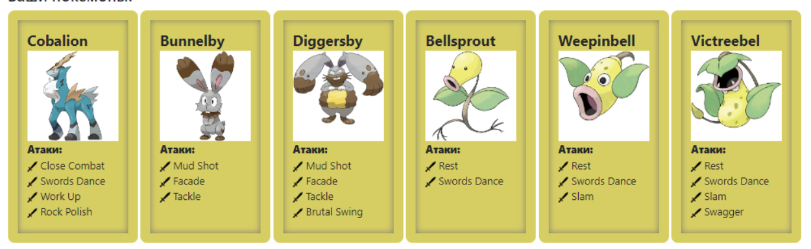

Вторая лаба.

Ознакомиться с документацией, обращая особое внимание на классы Pokemon и Move. При дальнейшем выполнении лабораторной работы читать документацию еще несколько раз.

Скачать файл Pokemon.jar. Его необходимо будет использовать как для компиляции, так и для запуска программы. Распаковывать его не надо! Нужно научиться подключать внешние jar-файлы к своей программе.

Написать минимально работающую программу и посмотреть, как она работает.

Battle b = new Battle();

Pokemon p1 = new Pokemon("Чужой", 1);

Pokemon p2 = new Pokemon("Хищник", 1);

b.addAlly(p1);

b.addFoe(p2);

b.go();

Создать один из классов покемонов для своего варианта. Класс должен наследоваться от базового класса Pokemon. В конструкторе нужно будет задать типы покемона и его базовые характеристики. После этого попробуйте добавить покемона в сражение.

Создать один из классов атак для своего варианта (лучше всего начать с физической или специальной атаки). Класс должен наследоваться от класса PhysicalMove или SpecialMove. В конструкторе нужно будет задать тип атаки, ее силу и точность. После этого добавить атаку покемону и проверить ее действие в сражении. Не забудьте переопределить метод describe, чтобы выводилось нужное сообщение.

Если действие атаки отличается от стандартного, например, покемон не промахивается, либо атакующий покемон также получает повреждение, то в классе атаки нужно дополнительно переопределить соответствующие методы (см. документацию). При реализации атак, которые меняют статус покемона (наследники StatusMove), скорее всего придется разобраться с классом Effect. Он позволяет на один или несколько ходов изменить состояние покемона или модификатор его базовых характеристик.

Доделать все необходимые атаки и всех покемонов, распределить покемонов по командам, запустить сражение.

